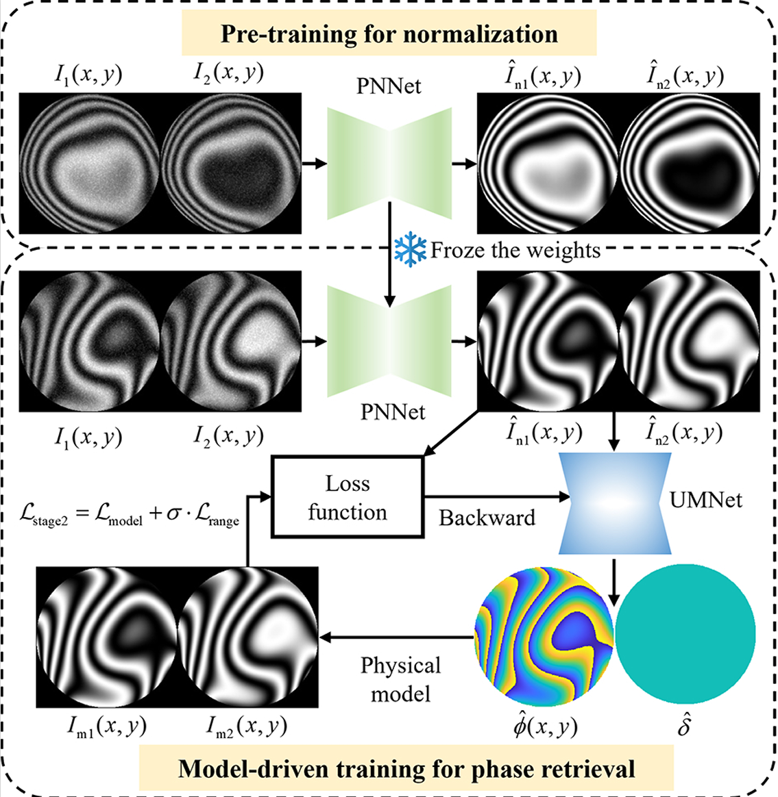

# Self-supervised Model-driven Deep Learning for Two-step Phase-shifting Interferometry

This repository contains the implementation of the paper "Self-supervised model-driven deep learning for two-step phase-shifting interferometry" (submitted to Optics Letters).

## Overview

This project presents a novel approach for high-precision phase demodulation from two-frame interferograms using a two-step neural network architecture based on NAFNet. The method combines self-supervised learning with physics-informed model-driven training to achieve accurate phase retrieval from interferometric data.

## Architecture


The proposed method consists of two sequential networks:

- **PNNet (Pre-training Normalization Network)**: A self-supervised network for data normalization and pre-processing
- **UMNet (Model-driven Unwrapping Network)**: A physics-informed network for phase retrieval that incorporates physical constraints

## Project Structure

```
├── main_unwrap.mlx          # MATLAB script for phase unwrapping and error calculation
├── NAFNet_arch.py           # NAFNet backbone architecture
├── Physics_loss.py          # Physics-informed loss functions
├── predict_PNNet.py         # Inference script for PNNet
├── predict_UMNet.py         # Inference script for UMNet  
├── train_PNNet.py           # Training script for PNNet (normalization pre-training)
├── train_UMNet.py           # Training script for UMNet (model-driven phase retrieval)
├── unwrap.m                 # MATLAB phase unwrapping utilities
├── model/                   # Directory for saved model weights
│   ├── PDNet.pth           # Pre-trained PNNet weights
│   └── UMNet.pth           # Pre-trained UMNet weights
├── utils/                   # Utility modules
│   ├── dataset_PNNet.py    # Dataset loader for PNNet training
│   └── dataset_UMNet.py    # Dataset loader for UMNet training
└── autodl-fs/              # Dataset directory
    ├── simu_train/         # Training data
    └── simu_test/          # Test data
```

## Requirements

### Python Dependencies
```bash
torch
torchvision
numpy
opencv-python
matplotlib
pandas
```

### MATLAB
- MATLAB R2019a or later
- Image Processing Toolbox

## Installation

1. Clone the repository:
```bash
git clone [repository-url]
cd model-driven
```

2. Install Python dependencies:
```bash
pip install torch torchvision numpy opencv-python matplotlib pandas
```

3. Ensure MATLAB is installed with required toolboxes.

## Usage

### Training

The training process consists of two sequential steps:

#### Step 1: Pre-training PNNet (Normalization Network)
```bash
python train_PNNet.py
```
This step trains the normalization network using self-supervised learning to prepare the data for the subsequent phase retrieval step.

#### Step 2: Training UMNet (Model-driven Phase Retrieval Network)
```bash
python train_UMNet.py
```
This step trains the phase retrieval network using physics-informed loss functions and the pre-trained PNNet weights.

### Inference

The inference process follows the same two-step approach:

#### Step 1: PNNet Prediction
```bash
python predict_PNNet.py
```
This generates normalized interferogram pairs from the input data.

#### Step 2: UMNet Prediction
```bash
python predict_UMNet.py
```
This performs phase retrieval from the normalized interferograms, producing wrapped phase maps.

#### Step 3: Phase Unwrapping
```matlab
main_unwrap
```
Run this MATLAB script to unwrap the phase maps and calculate error metrics.

## Dataset Format

The dataset should be organized as follows:

```
autodl-fs/
├── simu_train/
│   ├── frame1/          # First interferogram frames (training)
│   ├── frame2/          # Second interferogram frames (training)
│   ├── frame1_n/        # Normalized first frames (ground truth)
│   ├── frame2_n/        # Normalized second frames (ground truth)
│   └── phi/             # True phase maps (ground truth)
└── simu_test/
    ├── frame1/          # First interferogram frames (testing)
    ├── frame2/          # Second interferogram frames (testing)
    ├── frame1_n/        # Normalized first frames (ground truth)
    ├── frame2_n/        # Normalized second frames (ground truth)
    └── phi/             # True phase maps (ground truth)
```


## Model Configuration

### PNNet Configuration
- **Architecture**: NAFNet-based encoder-decoder
- **Input**: 2-channel interferogram pair
- **Output**: 2-channel normalized interferogram pair
- **Purpose**: Data normalization and noise reduction

### UMNet Configuration
- **Architecture**: NAFNet-based with physics constraints
- **Input**: 2-channel normalized interferogram pair
- **Output**: Wrapped phase map
- **Purpose**: Phase retrieval with physical consistency

## Results

The method produces wrapped phase maps that require subsequent unwrapping using the provided MATLAB scripts. Error metrics are calculated automatically during the unwrapping process.

## Citation


## License

This project is licensed under the MIT License - see the LICENSE file for details.

## Acknowledgments

- NAFNet architecture from "Simple Baselines for Image Restoration" by Chen et al.


